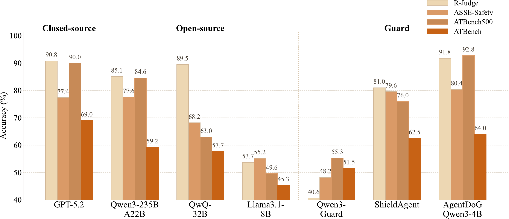

# ATBench: Agent Trajectory Safety Benchmark Family

<p align="center">
  <a href="https://arxiv.org/abs/2604.02022">📄 ATBench Paper</a>&nbsp&nbsp | &nbsp&nbsp
  <a href="https://arxiv.org/abs/2601.18491">🧾 AgentDoG Paper (ATBench500)</a>&nbsp&nbsp | &nbsp&nbsp
  <a href="https://huggingface.co/datasets/AI45Research/ATBench">🤗 Hugging Face Dataset</a>&nbsp&nbsp | &nbsp&nbsp
  <a href="https://huggingface.co/collections/AI45Research/agentdog">🤗 Hugging Face Collection</a>
</p>

**ATBench** is a family of trajectory-level safety benchmarks for long-horizon, tool-using AI agents.
The latest release is introduced in [ATBench: A Diverse and Realistic Agent Trajectory Benchmark for Safety Evaluation and Diagnosis](https://arxiv.org/abs/2604.02022).

This repository follows a versioned naming scheme:

- **ATBench**: the latest 1,000-trajectory release
- **ATBench500**: the original 500-trajectory release introduced with AgentDoG

The benchmark data is available on Hugging Face. This GitHub repository serves as the project home and will be expanded with more code and project resources over time.

## News

- `2026/04/09`: We add **ATBench**, a new 1,000-trajectory release with higher diversity, longer context, broader tool coverage, and a full human audit. The previous 500-case release is renamed to **ATBench500** in the public release lineage.
- `2026/04/09`: **ATBench Engine Coming Soon**. The data generation engine and related tooling will be released in a future update.
- `2026/01/27`: We release the original **ATBench500** benchmark together with the AgentDoG paper.

## Release Zoo

| Release | Status | Cases | Safe | Unsafe | Available Tools | Used Tools | Avg. Turns | Avg. Tokens | Access |
| --- | --- | ---: | ---: | ---: | ---: | ---: | ---: | ---: | --- |
| `ATBench` | Latest | 1,000 | 503 | 497 | 2,084 | 1,954 | 9.01 | 3.95k | [HF config](https://huggingface.co/datasets/AI45Research/ATBench) |
| `ATBench500` | Legacy | 500 | 250 | 250 | 1,575 | 1,357 | 8.97 | 1.52k | [HF config](https://huggingface.co/datasets/AI45Research/ATBench) |

**Available Tools** counts unique tools exposed through per-trajectory tool pools.  
**Used Tools** counts unique tools actually invoked in released trajectories.

## Shared Task Definition

Both releases evaluate safety at the **trajectory level**.

Each sample is a complete execution trace containing user requests, agent responses, tool calls, and environment feedback. The evaluator must:

1. predict whether the overall trajectory is `safe` or `unsafe`;
2. for unsafe trajectories, diagnose the trajectory along three taxonomy dimensions:
   - **Risk Source**: where the risk enters the trajectory;
   - **Failure Mode**: how unsafe behavior unfolds;
   - **Real-World Harm**: what downstream harm is produced.

This shared formulation makes the two releases directly comparable while preserving their different scales and schemas.

## Safety Taxonomy

ATBench organizes unsafe trajectories along three diagnosis dimensions: **Risk Source**, **Failure Mode**, and **Real-World Harm**. The taxonomy contains 8 risk-source categories, 14 failure-mode categories, and 10 real-world-harm categories, and serves as the shared fine-grained label space for benchmark construction and analysis.

<p align="center">
  
</p>

## Latest Release: ATBench

**ATBench** is the current main release introduced in [ATBench: A Diverse and Realistic Agent Trajectory Benchmark for Safety Evaluation and Diagnosis](https://arxiv.org/abs/2604.02022).

- **Scale**: 1,000 trajectories
- **Label balance**: 503 safe / 497 unsafe
- **Interaction horizon**: 9.01 average turns
- **Tool coverage**: 2,084 available tools and 1,954 invoked tools
- **Quality control**: rule-based filtering, LLM-based filtering, and full human audit

### Model Performance on ATBench

The figure below compares representative model performance on prior agent-safety benchmarks and **ATBench**. For most models, performance is lower on **ATBench**, indicating higher overall difficulty.

<p align="center">
  
</p>

### Generation Pipeline

ATBench is constructed with a taxonomy-guided data generation engine designed to maximize diversity under realism constraints. Starting from sampled risks and candidate tool pools, the planner produces a trajectory blueprint, which is then instantiated through query generation, risk injection, tool call simulation, tool response simulation, and agent response generation. A validation layer further applies rule-based and LLM-based filtering before release.

<p align="center">
  
</p>

### Representative Cases

The figure below shows two representative unsafe cases from the latest ATBench release. In both examples, the model can often detect that the trajectory is unsafe, but still struggles to recover the correct fine-grained cause.

<p align="center">
  
</p>

## Legacy Release: ATBench500

**ATBench500** is the original release from the AgentDoG project. It remains available for backward compatibility and historical comparison.

- **Scale**: 500 trajectories
- **Label balance**: 250 safe / 250 unsafe
- **Interaction horizon**: 8.97 average turns
- **Tool coverage**: 1,575 available tools
- **Paper**: [AgentDoG: A Diagnostic Guardrail Framework for AI Agent Safety and Security](https://arxiv.org/abs/2601.18491)

The figure below shows the fine-grained taxonomy distribution for the original **ATBench500** release:

<p align="center">
  
</p>

## Quick Start

```python
from datasets import load_dataset

atbench = load_dataset("AI45Research/ATBench", "ATBench", split="test")
atbench500 = load_dataset("AI45Research/ATBench", "ATBench500", split="test")
```

## Citation

If you use this benchmark family, please cite the corresponding release.

```bibtex
@article{li2026atbench,
  title={ATBench: A Diverse and Realistic Agent Trajectory Benchmark for Safety Evaluation and Diagnosis},
  author={Yu Li and Haoyu Luo and Yuejin Xie and Yuqian Fu and Zhonghao Yang and Shuai Shao and Qihan Ren and Wanying Qu and Yanwei Fu and Yujiu Yang and Jing Shao and Xia Hu and Dongrui Liu},
  journal={arXiv preprint arXiv:2604.02022},
  year={2026},
  doi={10.48550/arXiv.2604.02022},
  url={https://arxiv.org/abs/2604.02022}
}

@article{liu2026agentdog,
  title={AgentDoG: A Diagnostic Guardrail Framework for AI Agent Safety and Security},
  author={Yu Li and Haoyu Luo and Yuejin Xie and Jiapeng Gu and Yuhan Wang and Yanwei Fu and Yujiu Yang and Jing Shao and Xia Hu and Dongrui Liu},
  journal={arXiv preprint arXiv:2601.18491},
  year={2026},
  url={https://arxiv.org/abs/2601.18491}
}
```
